# School_District_Analysis

## Overview of the school district analysis
The school district asked to analyze student data. They asked to take a snapshot of several key indicators.
After the report was compiled and reviewed by The School Board, it was determined that the data of the 9th grade of Thomas High School had apparently been altered. The School Board asked to replace the math and reading scores for Thomas High School with NaNs while keeping the rest of the data intact. 
After that, it was needed to repeat the school district analysis and write up a report to describe how these changes affected the overall analysis.

## Results
a bulleted list that addresses how each of the seven school district metrics was affected by the changes in the data

### Deliverable 1 The reading and math scores for the ninth graders in Thomas High school are replaced with NaNs 
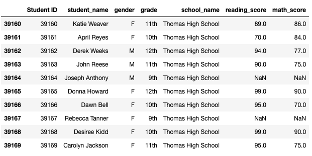

### Deliverable 2 Repeat the School District Analysis withpout the data of the 9th grade of Thomas High School

#### The district summary

##### Adjusted Analysis:
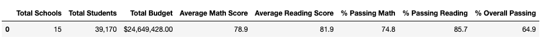

##### Original Analysis:
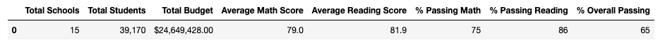

#####  The district summary was affected:
- The total count of students, Total schools and Total budget did not change
- The Average Math Score has decreased slightly (from 79,0  to 78,9)
- Much of the other metrics remained the same because we remove a small portion of the data

#### The school summary

##### Adjusted Analysis:
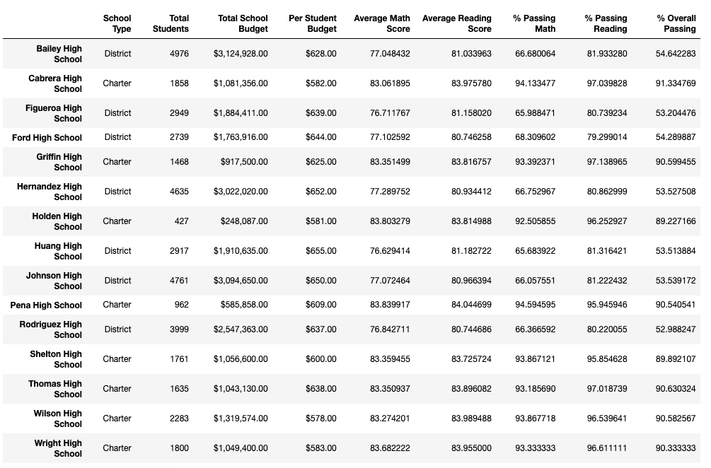

##### Original Analysis:
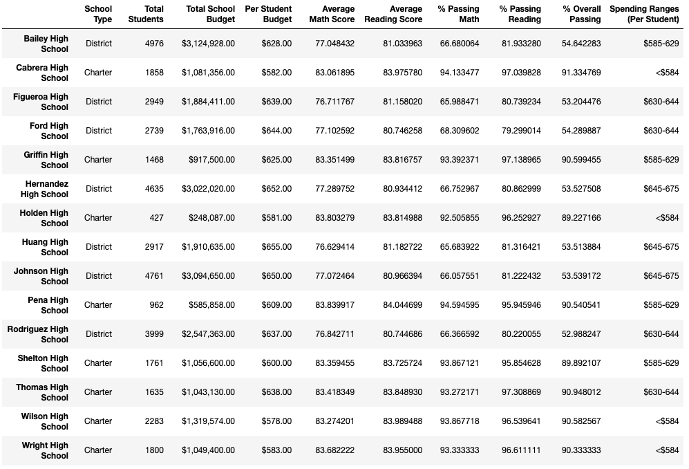

#####  The school summary was affected:
- 
the only differences are the averages and percent passing at Thomas High School. Even with the removal of certain data, the overall results remained fairly the same.

#### The top 5 and bottom 5 performing schools, based on the overall passing rate

##### Adjusted Analysis:
Top 5:
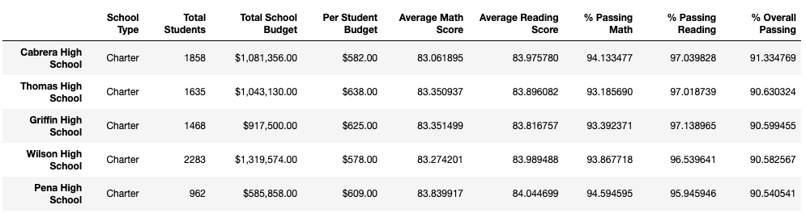

Bottom 5:
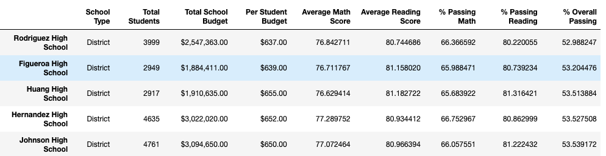

##### Original Analysis:
Top 5:
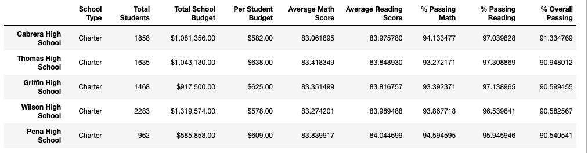

#### The average math score for each grade level from each school

##### Adjusted Analysis:
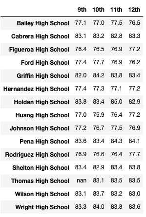

##### Original Analysis:
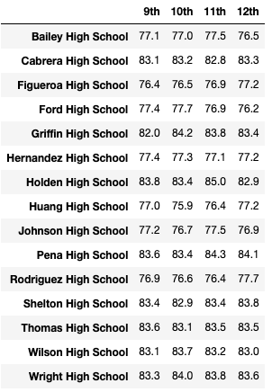

#### The average reading score for each grade level from each school

##### Adjusted Analysis:
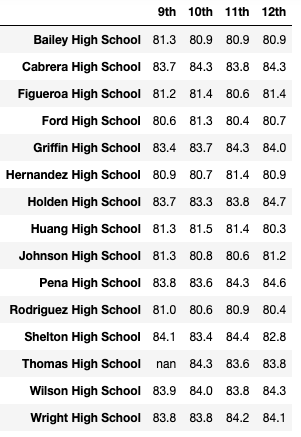

##### Original Analysis:
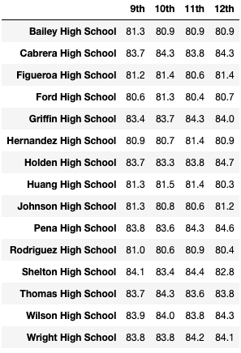

#### Scores by school spending per student

##### Adjusted Analysis:
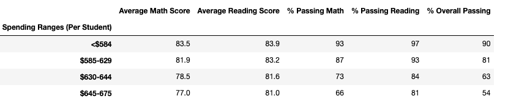

##### Original Analysis:

#### The scores by school size

##### Adjusted Analysis:
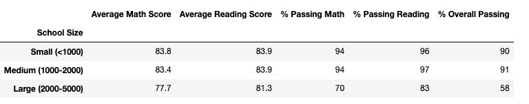

##### Original Analysis:
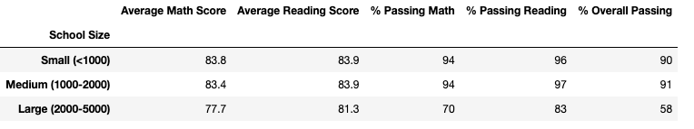

#### The scores by school type

##### Adjusted Analysis:
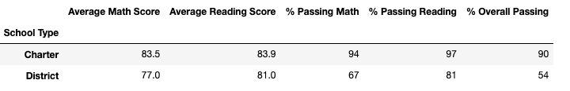

##### Original Analysis:

## Summary
a statement summarizing four changes to the school district analysis after reading and math scores have been replaced

